

    <h3 align="center">WebApp "<a href="https://learnlingo-vb.netlify.app">LearnLingo</a>"</h3>
    
LearnLingo is a web application designed to facilitate language learning. The application features a three-page layout: Home, Teachers, and Favorites. It is powered by Firebase for data handling and authentication, providing a seamless experience for users.

    
Table of Contents

    <ol>
        <li><a href="#features">Features</a></li>
        <li><a href="#technological-stack">Technological Stack</a></li>
        <li><a href="#links">Project Links</a></li>
    </ol>

## Features

### Home Page

The Home page serves as the introduction to LearnLingo. Users will see a banner with a call to action to start learning and a brief overview of the application's statistics.

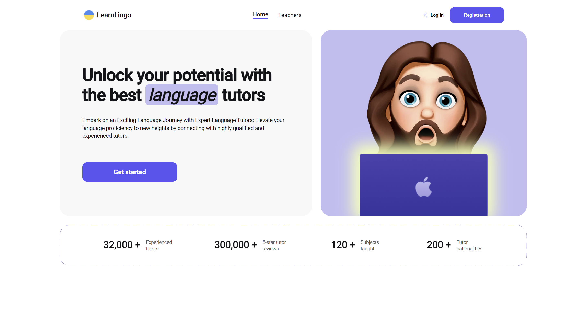

### Teachers Page

The Teachers page displays a list of all available teachers, which are paginated for convenience. Users can filter teachers based on the language they teach, the level of the student they are willing to teach, and the price of their lessons. Additionally, users can add teachers to their Favorites by clicking the heart icon on the teacher's card.

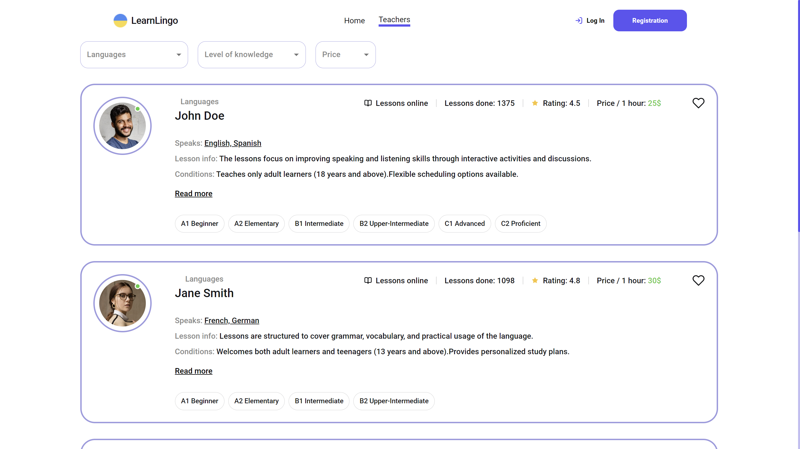
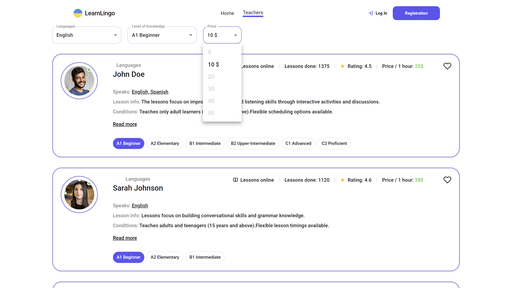
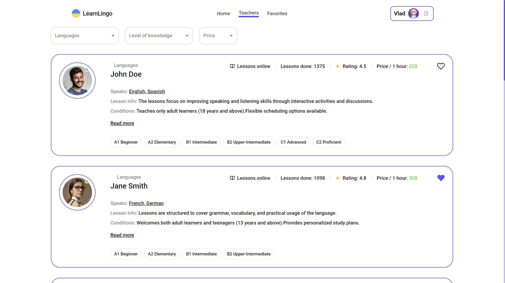
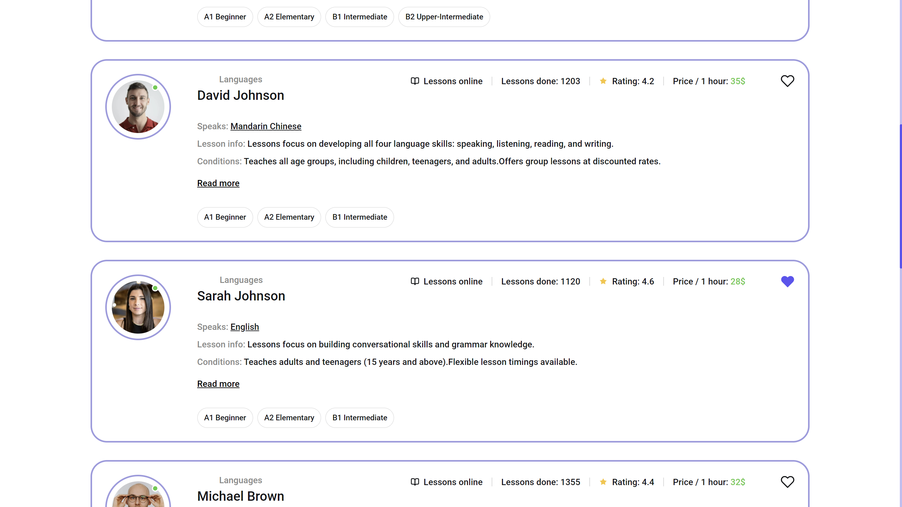

The most crucial feature on this page is the ability to book a teacher. By viewing detailed information about a teacher and clicking the "Book the trial lesson" button, users can schedule lessons.
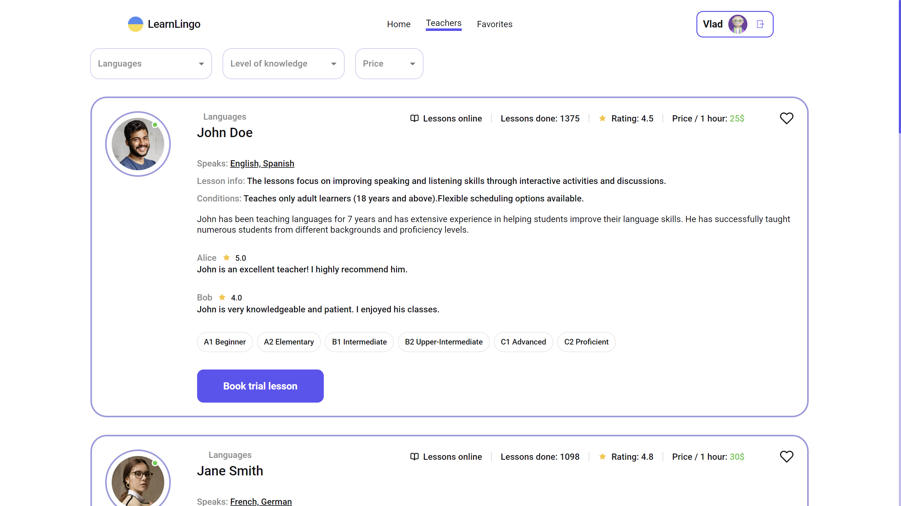
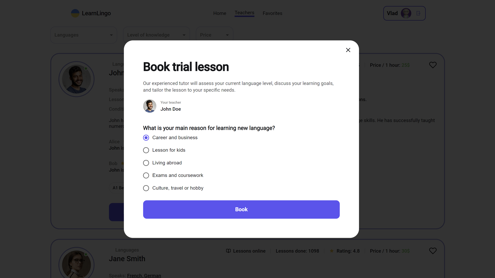
If the user is not logged in, they can fill in the fields of this window and register in this way.
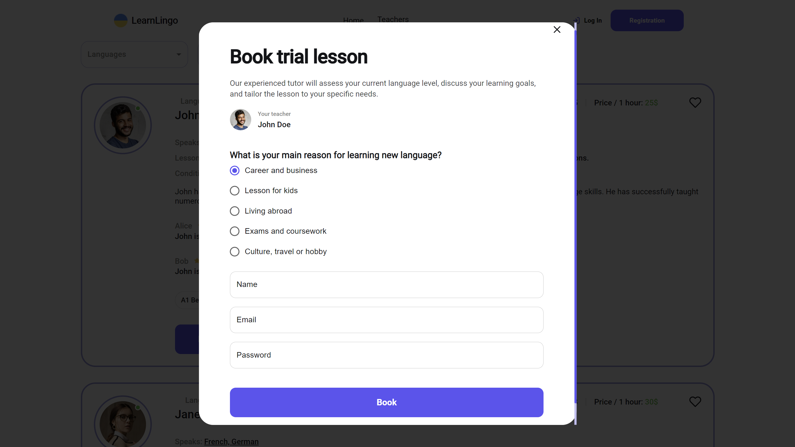

### Favorites Page

The Favorites page shows all the teachers that the user has marked as favorite. This makes it easy for users to quickly find and book their preferred teachers.

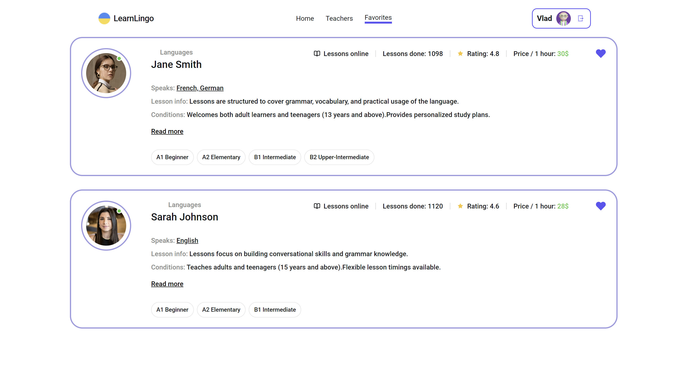

### Authentication

LearnLingo uses Firebase Authenticate for authentication. The following authentication features are implemented:

- **Registration**: Users can sign up using a dedicated modal window.
  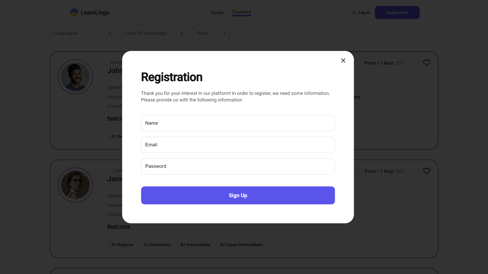

- **Login**: Users can log in through a separate modal window.
  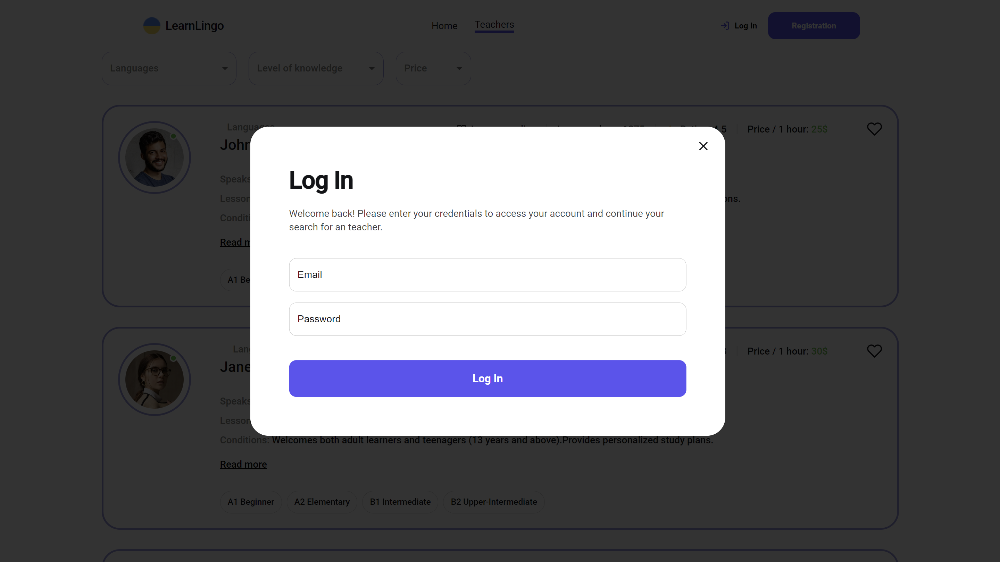

- **Logout**: Users can log out easily.
  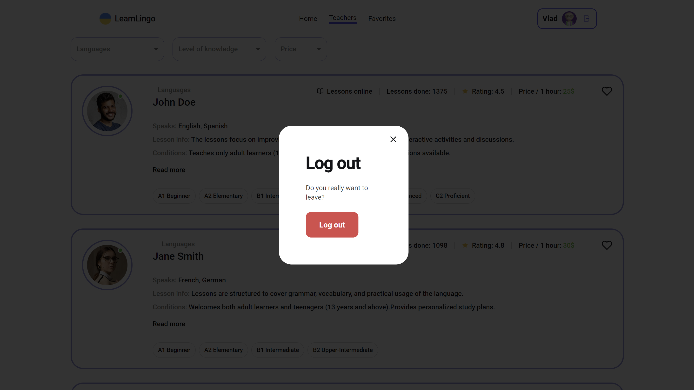

- **Auto-refresh User Session**: The user's session is automatically refreshed upon page reload.

## Technological Stack

- [React](https://react.dev)
- [React Redux](https://react-redux.js.org)
- [reduxjs/toolkit](https://redux-toolkit.js.org)
- [react-router-dom](https://reactrouter.com)
- [formik](https://formik.org/)
- [yup](https://www.npmjs.com/package/yup)
- [styled-components](https://styled-components.com)
- [mui/material](https://mui.com)
- [react-toastify](https://fkhadra.github.io/react-toastify/introduction/)

## Links

- **Project Page**: [LearnLingo](https://learnlingo-vb.netlify.app)
- **Design Mockup**: [Figma](https://www.figma.com/file/dewf5jVviSTuWMMyU3d8Mc/%D0%9F%D0%B5%D1%82-%D0%BF%D1%80%D0%BE%D1%94%D0%BA%D1%82-%D0%B4%D0%BB%D1%8F-%D0%9A%D0%A6?type=design&node-id=0-1&mode=design&t=jCmjSs9PeOjObYSc-0)
- **Technical Specification**: [Google Docs](https://docs.google.com/document/d/1ZB_MFgnnJj7t7OXtv5hESSwY6xRgVoACZKzgZczWc3Y/edit)

---

Thank you for using LearnLingo. We hope you enjoy your language learning journey!
